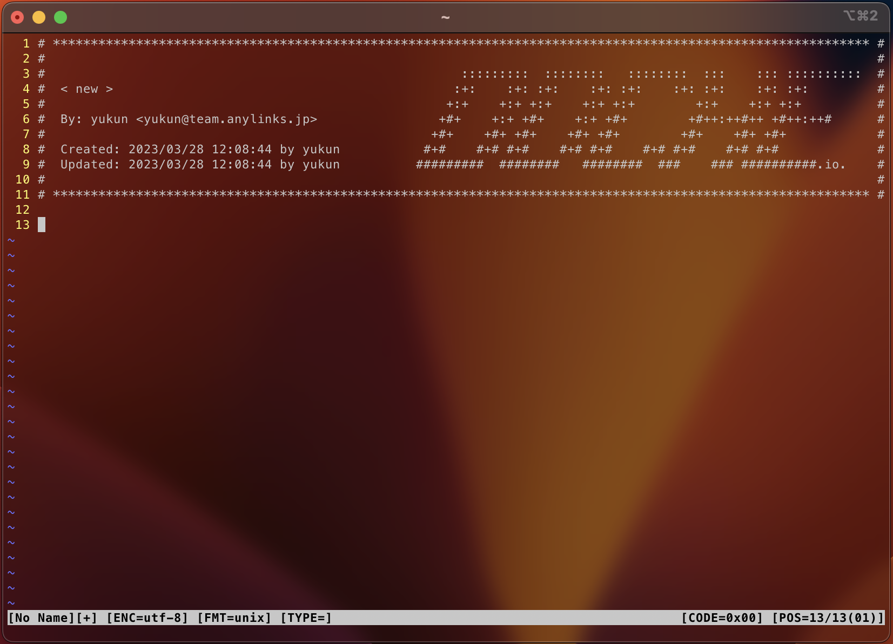

# **docheio Header**

docheio (Japan)

### **Description**

docheio standard header for vim editor.



### **UNIX Setup**

Copy `stddocheioheader.vim` in your `~/.vim/plugin`, or use your favorite plugin
manager. Then set the user and mail variables as explained below.

#### Option 1: export USER and MAIL in your shell configuration file

Add in `~/.zshrc` your:

+ `USER`
+ `MAIL`

#### Option 2: set user and mail values directly in your vimrc

```vim
let g:user_docheio = 'yourLogin'
let g:mail_docheio = 'yourLogin@doche.io'
```

### **Usage**

In **NORMAL** mode you can use `:Stddocheioheader`.

Under **Linux** you eventually need to disable the **help** shortcut of your **terminal** :
